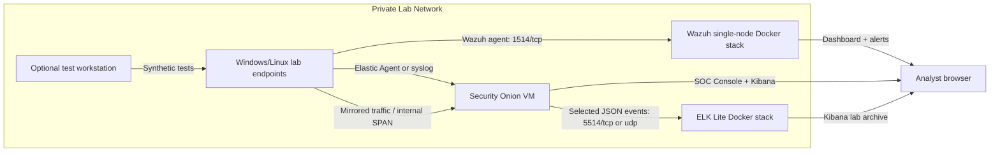

# Private SOC Lab Blueprint

An isolated SOC lab blueprint for practicing monitoring, detection, investigation, and response with Security Onion, Wazuh, and a lightweight ELK stack.

This project is designed for private virtual environments only: homelabs, classrooms, disposable training networks, and blue-team practice ranges.

## What You Get

- Security Onion VM guidance for network visibility, alerts, Hunt, cases, packet/metadata investigation, and analyst workflow.
- Wazuh single-node Docker launcher for host monitoring, file integrity monitoring, vulnerability/configuration visibility, and active response practice.
- ELK Lite Docker Compose stack for learning Elasticsearch, Kibana, and Logstash with JSON/syslog event intake.
- Response playbooks for common lab alerts such as SSH brute force, suspicious PowerShell, file changes, and network scans.
- GitHub-ready safety docs, validation script, ignore rules, and CI workflow.

## Safety Notice

Use this project only on systems and networks you own or have explicit permission to test. Keep dashboards and collection ports on host-only, internal, or otherwise isolated virtual networks. Do not expose this lab to the public Internet.

The included Wazuh active-response examples are intentionally opt-in. Tune and test detection rules before enabling any automated blocking.

## Architecture



## Requirements

- A virtualization platform such as VMware, VirtualBox, Hyper-V, Proxmox, or similar.
- Docker and Docker Compose for Wazuh and ELK Lite.
- Git for the Wazuh launcher.
- Enough RAM and disk for multiple security tools.

Recommended lab sizing:

| Component | Lab minimum | Better lab size | Notes |
| --- | ---: | ---: | --- |
| ELK Lite | 2 CPU, 4 GB RAM, 30 GB disk | 4 CPU, 8 GB RAM, 100 GB disk | Elasticsearch and Kibana bind to localhost by default. |
| Wazuh single-node | 4 CPU, 8 GB RAM, 50 GB disk | 4-8 CPU, 16 GB RAM, 100 GB disk | Linux/WSL2 Docker hosts need `vm.max_map_count=262144`. |
| Security Onion Standalone | 4 CPU, 24 GB RAM, 200 GB disk, 2 NICs | 8 CPU, 32+ GB RAM, SSD, 2+ NICs | Use one management NIC and one sniffing NIC. |

## Quick Start

Clone the repository, then validate the project files:

```powershell
.\scripts\validate-repo.ps1
```

Start the ELK Lite listener:

```powershell
cd elk-lite
Copy-Item .env.example .env
docker compose up -d
.\scripts\send-test-events.ps1
```

Open Kibana at `http://localhost:5601` and create a data view for `soc-lab-*`.

Start Wazuh single-node:

```powershell
cd ..\wazuh
.\start-wazuh-single-node.ps1
```

Open `https://localhost`. The official Wazuh Docker stack uses `admin` / `SecretPassword` by default. Change the password before keeping the lab online.

Deploy Security Onion as a VM using [security-onion/VM-setup-checklist.md](security-onion/VM-setup-checklist.md). Use Standalone mode for a persistent lab if you have enough memory. Use Evaluation mode only for short temporary testing.

## Repository Map

```text
.
|-- docs/
|   |-- architecture.md
|   |-- github-publish-checklist.md
|   |-- operations.md
|   `-- response-playbooks.md
|-- elk-lite/
|   |-- docker-compose.yml
|   |-- logstash/
|   `-- scripts/send-test-events.ps1
|-- security-onion/
|   |-- VM-setup-checklist.md
|   `-- custom-logstash-forwarding/
|-- wazuh/
|   |-- active-response-snippets.xml
|   |-- agent-install-examples.md
|   |-- custom-rules/local_rules.xml
|   `-- start-wazuh-single-node.ps1
|-- scripts/validate-repo.ps1
|-- CONTRIBUTING.md
|-- LICENSE
`-- SECURITY.md
```

## Detection And Response Practice

Start with these exercises:

- Send synthetic JSON events into ELK Lite and build a Kibana data view.
- Enroll a Windows or Linux endpoint into Wazuh and confirm host alerts.
- Add the sample Wazuh local rules and trigger `SOC_LAB_TEST`.
- Deploy Security Onion with a sniffing interface and generate benign scan traffic from a lab test workstation.
- Work through [docs/response-playbooks.md](docs/response-playbooks.md) and record a timeline for each exercise.

## Academic Use

This project can support an undergraduate or master's thesis when framed as a design, implementation, and evaluation study rather than a tool installation report.

Suggested thesis title:

```text
Design, Implementation, and Evaluation of an Isolated Virtual Security Operations Center for Security Monitoring, Detection, and Incident Response Training
```

Academic planning documents:

- [Thesis proposal](docs/thesis-proposal.md): formal title, abstract, problem statement, research questions, methodology, ethics, limitations, and chapter structure.
- [Evaluation framework](docs/evaluation-framework.md): hypothesis, variables, experiment matrix, metrics, rubrics, and results tables.

The recommended research contribution is a reproducible SOC lab artifact plus an evaluation of detection coverage, alert fidelity, triage workflow, and response usefulness.

## GitHub Publishing

Before making the repository public, run through [docs/github-publish-checklist.md](docs/github-publish-checklist.md). The short version:

- Do not commit `.env`, certificates, packet captures, endpoint logs, VM exports, or real incident data.
- Run `.\scripts\validate-repo.ps1`.
- Run `docker compose -f elk-lite\docker-compose.yml config` on a machine with Docker.
- Test the ELK Lite quick start once on a disposable machine.

## Roadmap

- Add sample Kibana saved objects using synthetic events.
- Add Wazuh agent group examples for Windows and Linux lab endpoints.
- Add Security Onion case templates for common beginner investigations.
- Add screenshots using synthetic data only.
- Add optional Terraform or Vagrant examples for repeatable lab networking.

## Vendor References

- Wazuh Docker deployment: https://documentation.wazuh.com/current/deployment-options/docker/wazuh-container.html
- Wazuh active response: https://documentation.wazuh.com/current/user-manual/capabilities/active-response/index.html
- Elastic Docker Compose deployment: https://www.elastic.co/docs/deploy-manage/deploy/self-managed/install-elasticsearch-docker-compose
- Security Onion documentation: https://securityonion.net/docs/
- Security Onion ISO verification: https://securityonion.net/download/

## License

MIT. See [LICENSE](LICENSE).
